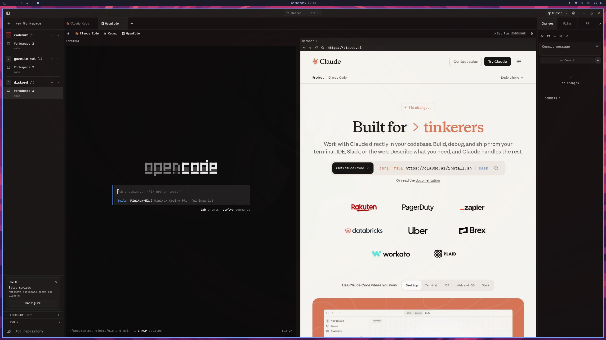

<div align="center">


# Codemux

**The Agentic Development Environment for Builders**

<!-- Replace with your screenshot -->



</div>

---

Codemux is a Linux-first workspace that brings terminals, browser panes, and multi-agent orchestration into one app. Run coding agents side by side, review changes, test in-browser, and ship — without leaving the window.

## Features

- **Multi-workspace terminals** — Split, resize, swap, and manage terminal sessions across isolated workspaces
- **Browser panes** — Embedded browser alongside your terminals for testing and agent-assisted browsing
- **Git worktree isolation** — Each workspace gets its own worktree so agents never interfere with each other
- **Built-in diff review** — See what changed, commit, and manage branches without switching tools
- **OpenFlow orchestration** — Run multiple AI agents in parallel with automatic task delegation and stuck detection
- **Notifications & attention signals** — Know exactly when an agent needs you, with desktop notifications and per-pane indicators
- **CLI & socket control** — Automate everything via `codemux` CLI or the local Unix socket API
- **Custom keybinds** — Full keyboard-first workflow with a command palette and rebindable shortcuts

## Install

### AppImage (any Linux distro)

Download the latest `.AppImage` from [Releases](https://github.com/Zeus-Deus/codemux/releases), make it executable, and run:

```bash
chmod +x Codemux-*.AppImage
./Codemux-*.AppImage
```

### Requirements

- Linux (X11 or Wayland)
- [ydotool](https://github.com/ReimuNotMoe/ydotool) — required for browser automation features

## Quick Start

1. Launch Codemux
2. Create a project by pointing it at a git repository
3. Create a workspace — each workspace gets an isolated git worktree
4. Open terminal panes, start your coding agent, and work

Split panes with keybinds, open a browser pane for testing, and use the changes panel to review diffs and commit when ready.

## Build from Source

```bash
# Clone the repo
git clone https://github.com/Zeus-Deus/codemux.git
cd codemux

# Install dependencies
npm install

# Run in development mode
npm run tauri:dev

# Build for release
npm run tauri:build
```

**System dependencies:** Rust, Node.js, and the [Tauri prerequisites](https://v2.tauri.app/start/prerequisites/) for your distro.

## License

Elastic License 2.0 — see [LICENSE.md](LICENSE.md).
