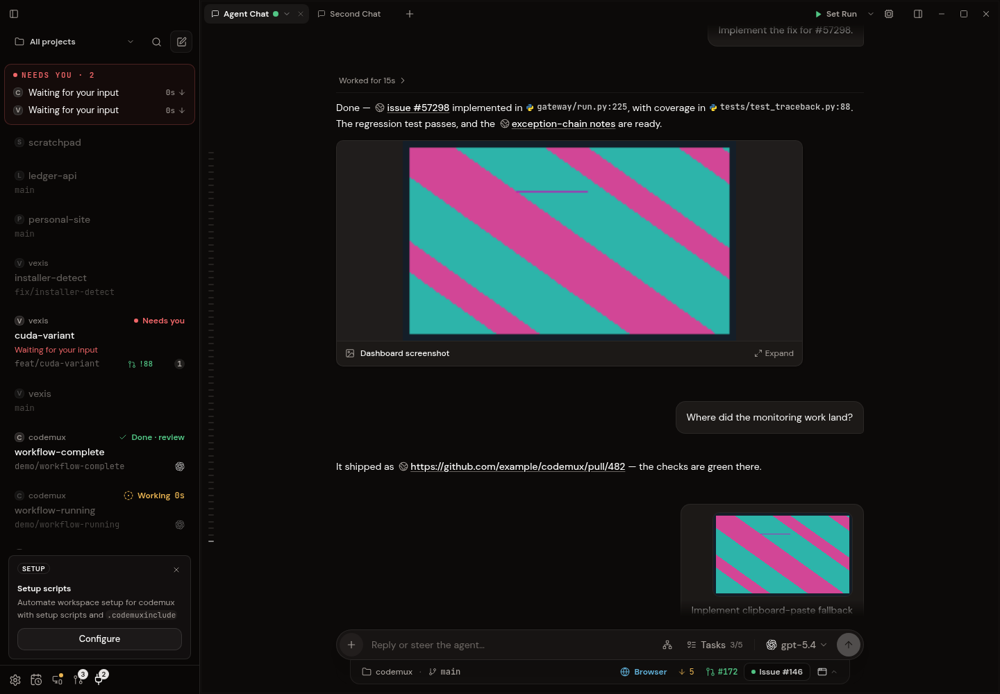
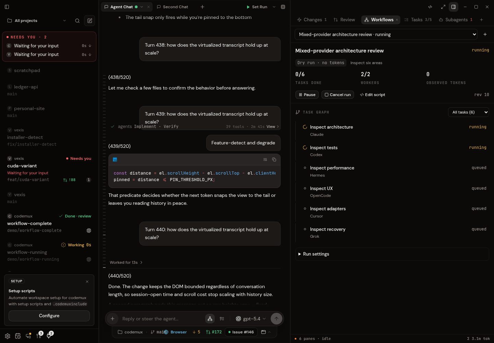
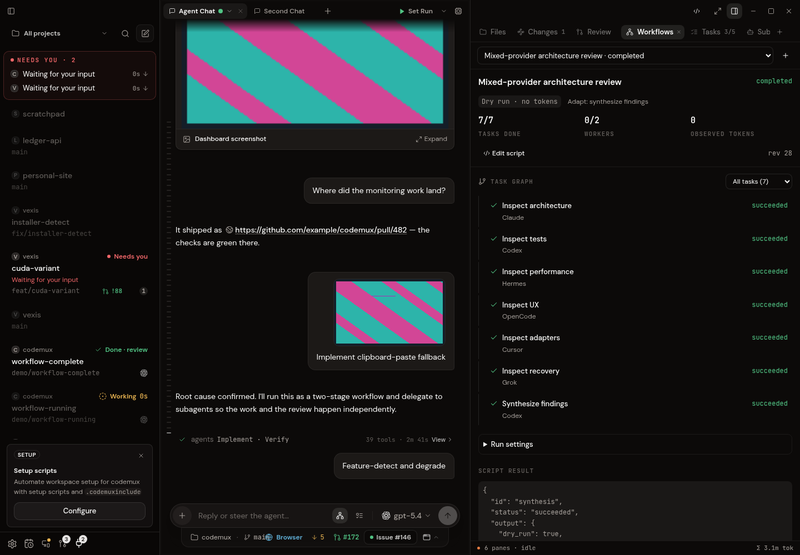
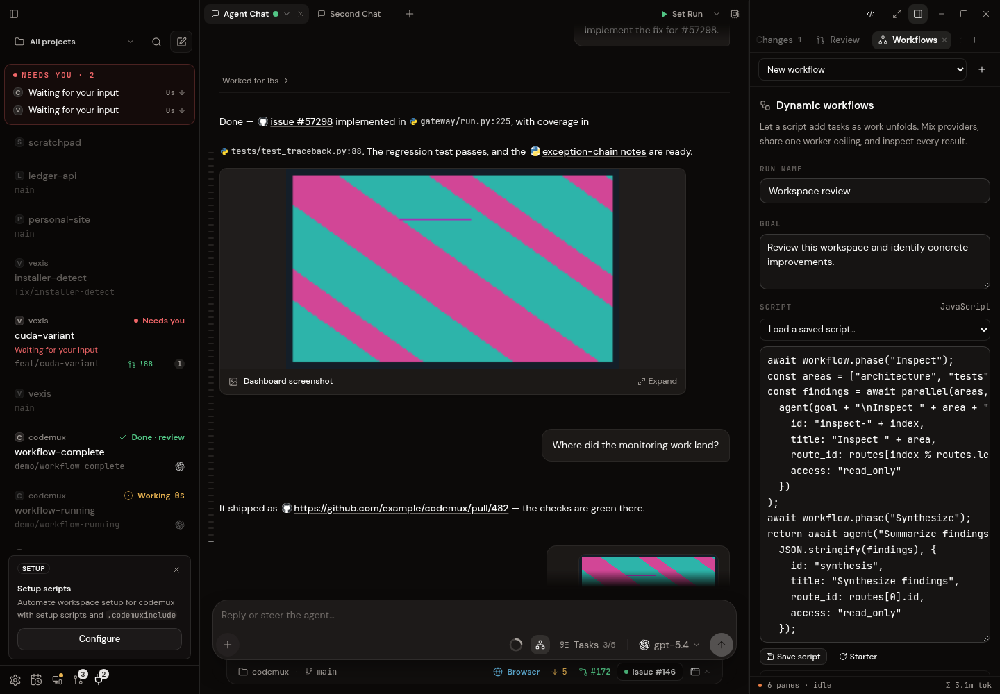
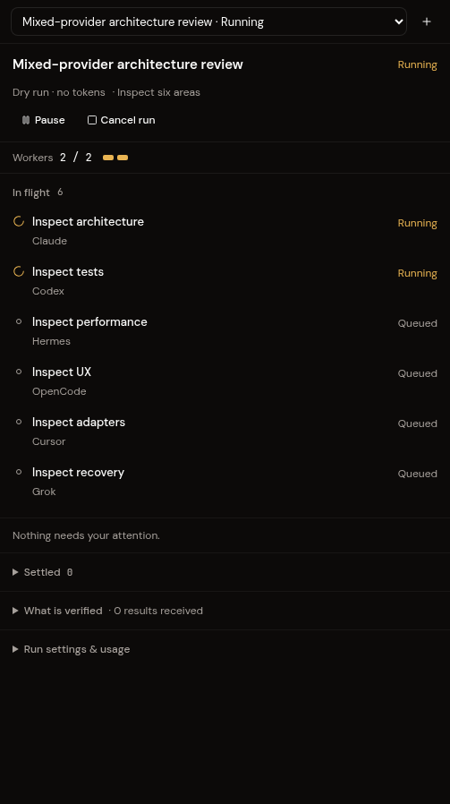

# Dynamic workflows

CodeMux owns the workflow graph, durable execution records, resource limits and
artifact acceptance. Scripts and admitted coordinator agents can add work as
results arrive, choose a configured provider/model route, replace tasks, send
guidance, cancel execution, or retire work that is no longer needed. This pane
is independent of a provider's reasoning effort and native orchestration pane.

## Use it

1. Enable Agent Chat and open **Workflows** from the composer or right panel.
2. Set the goal and select a provider pool. The read-only starter reviews three
   areas and synthesizes their results. **Workflow script** and **Models and
   routes** expose optional customization, including multiple models per provider.
   OpenCode requires an explicit `provider/model`; Cursor SDK routes require
   standalone effort to be empty. These requirements are shown before live launch.
3. Optionally open **Limits** to set worker, task, attempt, depth, output, token
   and time limits. **Auto** uses a safe host ceiling; the program chooses how
   many tasks to add.
4. Choose **Dry run** to exercise the production scheduler without calling any
   provider. The browser development preview has a separate synthetic runtime.
5. Choose **Run with agents** only when every selected route reports live support.
   Writing requires the separate **Allow file changes** opt-in and an explicit
   task scope. Changes stay in retained snapshots until reviewed and applied.

Managed execution requires **Linux and a local Git workspace**. Claude and Codex
use their existing native harnesses. Cursor, OpenCode and Hermes now have separate
managed adapters with explicit setup and version/API checks. Grok remains dry-run
only because its native stdio interface does not yet establish the required tool
and fanout boundary. Support is checked before inference; a provider integration
does not imply every authentication mode or native setting is supported.
The pane does not silently substitute another provider. Web remote and mobile
execution are currently unavailable.

| Provider | Managed route requirements | Verification |
| --- | --- | --- |
| Claude | Existing SDK/CLI authentication; isolated managed SDK tools | Native paid coordination canary and fake SDK tests |
| Codex | App-server API accepting the empty native environment and startup policy | Token-free native readiness and fake RPC tests |
| Cursor | Shipped official SDK 1.0.37; `CURSOR_API_KEY` or existing SDK-owned login; effort unset | Fake SDK, compiled official native workspace/parser probe and host bridge tests |
| OpenCode | Prepared native 1.18.35; explicit built-in `provider/model`; environment API key; no administrator config | Actual native readiness/private MCP/session policy with dummy key, plus fake HTTP tests |
| Hermes | Prepared official source and Python 3.14 venv via `CODEMUX_HERMES_SOURCE` and `CODEMUX_HERMES_PYTHON`; explicit API-key/local profile route | Fake official-library/RPC tests; local installed Python 3.11 correctly rejected |
| Grok | Unavailable pending an upstream catalog/fanout contract or a separately reviewed native wrapper | Official source audit; fails closed |

Cursor's ordinary CLI login is separate from its SDK login. The managed adapter
does not copy credentials or start OAuth. OpenCode isolates configuration, data,
cache, home discovery and state per attempt; its managed path currently excludes
native OAuth/custom plugin providers. Hermes may select an existing profile home
with `CODEMUX_HERMES_PROFILE_HOME`; ordinary ACP profile history is not imported.
Named providers, OAuth pools, plugin routing and external-process APIs are rejected.
See [provider research and native boundaries](workflow-provider-research.md) and
[Hermes setup](../hermes-provider.md). No paid Cursor, OpenCode or Hermes turn was
run in this verification.

Managed workers have no native shell/build/test commands, native subagents,
plugins, hooks or unrestricted MCP servers. This is deliberate capability gating:
existing ordinary Agent Chat sessions retain their normal tools. Extending a
managed adapter or adding command execution requires preserving the same caller
identity, permission and verified-stop contracts.

Managed Codex requires an app-server that acknowledges an empty native environment
selection, disabled approvals and a read-only startup policy. Older or unknown
APIs fail before a model turn, with no fallback to native file access. Filesystem
and command tools are restricted; provider utility tools can remain. This is a
model-tool boundary, not an OS sandbox for an untrusted provider executable.

## Program API

Scripts are async function bodies; top-level `await` and `return` are supported.
They receive `goal`, `args`, `routes` and `allow_writes`. Route entries include
`id`, `provider`, `model` and `effort`. Route choices cannot expand the run's pool.

```js
await workflow.phase("Inspect");
const areas = ["architecture", "tests", "integration"];
const findings = await parallel(areas, (area, index) =>
  agent(goal + "\nInspect " + area, {
    id: "inspect-" + index,
    title: "Inspect " + area,
    route_id: routes[index % routes.length].id,
    access: "read_only"
  })
);

// A later task is created from observed results, rather than an upfront plan.
await workflow.phase("Synthesize");
return await agent(JSON.stringify(findings), {
  id: "synthesis",
  title: "Synthesize findings",
  route_id: routes[0].id
});
```

`agent(prompt, options)` creates a task and awaits its typed outcome. Outcomes
include `id`, `generation`, `status`, `output`, `error`, and accepted `artifacts`.
A failed task returns a failed outcome; workflow code can inspect it and repair
the plan. Agent prose is never accepted as an execution result.

| API | Behavior |
| --- | --- |
| `parallel(items, mapper?)` | Await independent operations concurrently. `pipeline` is an alias. |
| `workflow.addTask(spec)` / `addTasks(specs)` | Add tasks and receive stable IDs. |
| `workflow.wait(id)` | Await a task's typed outcome. |
| `workflow.list()` | Inspect task IDs, states, generations and dependencies. |
| `workflow.replace(id, spec)` | Replace stopped work; increment its generation and invalidate declared dependents. |
| `workflow.message(id, text)` | Queue guidance for the next admission or continuation. |
| `workflow.cancelTask(id)` | Revoke execution authority and stop the task/subtree; required cancelled work needs repair. |
| `workflow.retire(id)` | Withdraw unneeded work while preserving evidence. Its declared dependents still need valid results. |
| `workflow.phase(text)` / `log(text)` | Record a phase or bounded journal entry. |

Await every workflow operation. Supply explicit stable IDs for reusable plans.
Task options include `dependencies`, `route_id`, `access`, `scope`, `required` and
`output_schema` (also accepted as `schema` by `agent`). Write scopes are relative
paths such as `src/workflows`; `.` means the whole copied workspace. A script
cannot grant write permission. JSON Schema results are checked by the host;
external file/HTTP schema retrieval is disabled.

The production QuickJS runtime exposes no Node/browser APIs, network, filesystem,
timers or module loader. Time/randomness are unavailable; pass stable inputs in
`args`. Each script has a 32 MiB memory limit, stack and instruction limits, a
host deadline, a 10,000-call limit, and a 32 MiB observation-journal limit. Up to
four scripts can execute concurrently. Cancelling a run also interrupts a script
suspended on a never-resolving Promise.

Native coordinator agents receive equivalent attempt-scoped graph tools and the
allowlisted route catalog. `workflow_wait` yields the worker instead of occupying
a slot while children run; the host resumes it in a fresh managed attempt with
typed child outcomes. Parents can replace failed children and yield again.
Children inherit or narrow access/scope and cannot modify unrelated branches.

## Configuration

Release host policy lives at the OS configuration directory's
`codemux/workflows.json` (Linux: `~/.config/codemux/workflows.json`). Debug builds
use `codemux-dev`. Configuration is optional; invalid/unknown keys fail closed.
Restart the app after editing host policy.

```json
{
  "global_concurrency": 8,
  "provider_concurrency": { "claude": 4, "codex": 4 },
  "run_caps": {
    "concurrency": 8,
    "max_tasks": 500,
    "max_attempts": 1000,
    "max_depth": 3,
    "max_output_bytes": 1048576,
    "wall_time_ms": 3600000
  }
}
```

A workspace can add `.codemux/workflows.json` containing run caps directly:

```json
{
  "concurrency": 2,
  "max_tasks": 100,
  "token_budget": 100000,
  "deny_writes": true
}
```

Project caps can only narrow the requested limits and cannot grant permissions.
Run settings show the effective pinned limits. Global/provider ceilings apply
across all runs and across multiple routes for the same provider. Default global
capacity is eight; Auto resolves to at most four workers. Supported explicit
ceilings are bounded, rather than unlimited process creation.

Token budgets govern admission using observed tokens, outstanding reservations
and conservative estimates where final accounting is missing. The UI distinguishes
observed totals from estimates. These are not a provider-enforced invoice cap:
an admitted model turn can exceed its reservation before final usage arrives.

## Ownership, recovery and file changes

Execution intent is committed in a separate SQLite WAL database before dispatch.
Only one process owns its runtime; opening another GUI/headless process cannot
recover or revoke a running controller's database. Task/attempt identity is
captured by the host and never taken from model-supplied run IDs or PIDs.

Pause stops new admissions and script operations while admitted workers finish.
Cancel revokes authority immediately, then retains capacity until the provider
process group and tracked host callbacks are confirmed stopped. Uncertain startup,
lost accounting or an unconfirmed stop becomes **Unknown**, not an automatic retry.
After restart, interrupted runs require explicit recovery/resume. **Reconcile
task** checks trusted runtime identity and quiescence; it cannot simply clear a
hold because the user clicked it. An interrupted task can then be retried.
Linux recovery uses boot ID, process start identity, process-group membership and
prior-host identity. Missing evidence or a still-live owner keeps the hold.

Completed script observations replay in their original delivery order, preserving
completion-dependent branches. Reusing a mutation key with different input is
rejected. A durable mutation with an uncertain completion fails closed rather
than being blindly issued twice. Replay does not mean resuming an unrestricted
native provider session.

A live run pins tracked files plus nonignored untracked files, including the
workspace's current edits. Workers receive isolated copies without shared Git
metadata. Git indexes, branches and user worktrees are never worker write targets.
Snapshots reject symlinks and unsupported files; checkout and file sizes are
bounded. Retained artifacts have a 4 GiB logical storage ceiling and a one-million
node ceiling; quota accounting is reconstructed once and updated under the store
lock, rather than traversing all retained files for each tool write. Accepted
outputs/history within one run are additionally limited to 32 MiB, and queued
guidance messages share a 4 MiB per-run ceiling. Retained graph-mutation inputs,
durable command outcomes and script observations each have a 32 MiB ceiling with
bounded entry counts; transactional counters avoid rescanning old payloads for
every operation. Run-picker queries return summaries, avoiding transferring every
historical transcript.
Accepted artifacts are sealed only after verified stop, and contain a
hash-verified manifest and changed paths.

Open **Review file changes** to inspect bounded before/after contents and hashes,
then explicitly **Apply changes**. Binary/truncated files are identified. Applying
checks the current task generation, accepted digest, workspace ownership, scope
and source content; retirement/replacement revokes old application authority.
Independent editors do not participate in CodeMux's mutex, so conflicts are
rechecked immediately before each file mutation. Multi-file application is not
globally atomic; retained journals preserve evidence for recovery. Retrying an
interrupted application recognizes unchanged accepted postimages, applies the
remaining baseline paths and refuses unrelated editor changes.

Retained artifacts are not automatically deleted. Inspect them before removing
old data manually; unknown attempts may still own execution or file-change holds.

## Verification and screenshots

Initial verification used synthetic providers, fake SDK queries, temporary
workspaces and owned local test processes, without paid inference sessions. These
tests establish host contracts and UI behavior; they do not establish model
planning quality or compatibility with an actual inference session.

An isolated, unauthenticated Codex 0.160.0 configuration and empty-thread check
also verified the native environment/approval acknowledgments without starting a
model turn. A Tauri MockRuntime IPC test exercises the production command handlers,
persistent database, script VM and dry-run scheduler without a provider registry.

Observed verification: production frontend build, frontend/Rust/Claude-sidecar
type checks, 196 affected frontend tests, 69 workflow tests, six managed-adapter
tests, 40 fake Claude SDK tests, and ten browser flows passed. That initial
verification used no model turns or paid tokens. The Codex boundary also follows
the official
[environment selection API](https://github.com/openai/codex/blob/rust-v0.160.0/codex-rs/app-server-protocol/src/protocol/v2/thread.rs#L136)
and [environment-gated native tools](https://github.com/openai/codex/blob/rust-v0.160.0/codex-rs/core/src/tools/spec_plan.rs#L1083).

Additional deterministic provider tests exercise the production live driver,
captured graph/file/result tools and artifact store. With one worker, a coordinator
spawns mixed-route children, yields, receives a failed result, replaces that child,
imports accepted changes and resumes after SQLite reopen without repeating the
successful sibling. A later continuation can freshly wait for an older successful
sibling and read its accepted artifact. Separate cases verify that an uncertified
stop retains its capacity and token reservation until explicit reconciliation,
and that QuickJS coordinates the live host tools through repair and synthesis.
The `workflow_runtime_` filter passed four tests, including runtime ownership.
Reopen occurs within the same test process; this is not an operating-system crash
test, and the providers are deterministic fixtures rather than native model calls.
At that stage the affected `--lib workflows` run passed 72 tests, including these stricter
runtime cases, in 17.17 seconds without native inference; `cargo check` also passed.

Five fake native-RPC adapter tests also passed, covering Claude completion before
its send acknowledgment, preserved turn identity, managed-tool wiring, Codex's
empty environment selection and rejected Claude/Codex startup with verified
owned-process cleanup. These test the adapters with local fake processes, without
inference. The final `managed_` filter passed eight tests, and the Claude sidecar
type check and 47 fake SDK session tests passed. A translator regression also
verifies that an SDK result carrying `is_error: true` remains a failed turn even
when its subtype is `success`, without losing its usage counters.

### Native inference canary

The separately authorized [native canary](../../src-tauri/tests/workflow_live_canary.rs)
passed in 11.33 seconds with Claude Haiku 5.5 and Claude CLI 2.1.295, using the
production scheduler, live driver, Claude adapter and compiled sidecar in a
temporary Git workspace. With capacity one, the coordinator programmatically
created two children and yielded. The children read the fixture files and
submitted accepted typed values 17 and 25. A fresh coordinator continuation
received their results and submitted the accepted aggregate
`{"sum":42,"child_count":2}`. There were exactly four native sessions; all owned
sessions stopped, the runtime exited and the source workspace remained unchanged.

Each native SDK initialization reported exactly the eleven captured host tools
and the connected CodeMux MCP server, with no native built-in tools. Managed
startup now waits for the SDK initialization and exact captured MCP catalog before
acknowledging readiness. The test used an explicit SDK budget of $0.20 and six
turns per session, four sessions, 1,024 output tokens per request and a 90-second
run deadline. SDK budget enforcement is client-side and can overshoot by one API
call; these caps supplemented the separately authorized cumulative $2 test limit.

The successful run reported $0.00230806 in SDK counters. Its deliberately yielded
first coordinator attempt had no final dollar counter, so the report retains a
$0.20 incomplete-session allowance. Across all functional test attempts, observed
SDK cost was $0.01005738; three incomplete-session allowances produce a conservative
$0.61005738 envelope. Previous failed reports were preserved: two network-blocked
runs and three native runs configured with a 512-token test output cap. The latest
of those runs captured an explicit truncation error and the full tool catalog,
which justified raising that cap to 1,024. The sanitized reports preserve actual native catalog,
task transitions, typed results, accounting uncertainty and verified cleanup.

This canary establishes a small real Claude coordination path. Mixed Claude/Codex
execution is covered by deterministic providers; a paid native Codex turn, large
fanout and an operating-system crash recovery test were not exercised here.

### Focused checks

Focused frontend checks:

```sh
npm run check
npm run test -- src/components/workflows/workflow-panel.test.tsx src/components/workflows/workflow-presentation.test.ts src/dev/workflow-mock.test.ts
```

Rust checks in an unbundled checkout without packaged sidecars:

```sh
TAURI_CONFIG='{"bundle":{"externalBin":[],"resources":[]}}' \
  CARGO_PROFILE_DEV_DEBUG=0 CARGO_PROFILE_TEST_DEBUG=0 \
  cargo check -j 2 --manifest-path src-tauri/Cargo.toml

TAURI_CONFIG='{"bundle":{"externalBin":[],"resources":[]}}' \
  CARGO_PROFILE_DEV_DEBUG=0 CARGO_PROFILE_TEST_DEBUG=0 \
  cargo test -j 2 --manifest-path src-tauri/Cargo.toml --lib workflows -- --test-threads=2
```

Also run the `managed_` Rust filter for adapter policy and owned process-group
shutdown checks, and `bun run typecheck` plus `bun test test/session.test.ts` in
`sidecar/claude-agent` for the fake Claude SDK boundary.

For browser verification, start `npm run dev -- --host 127.0.0.1`, then run
`node scripts/e2e/workflows-ui.mjs`. It uses local Chromium and Puppeteer Core from
the global Puppeteer installation; `CODEMUX_CHROMIUM` and
`CODEMUX_PUPPETEER_MODULE` override those locations. External requests are blocked.
The test covers dynamic mixed routes, worker ceilings, saved scripts, pause/drain,
reload replay, synthesis, task results, cancellation/retry, write refusal, file
review, uncertain worker holds, keyboard focus and responsive layouts. Its fixture
includes synthetic provider labels; this does not indicate live support for those
adapters.

**Before**



**After — dynamic fan-out with a shared worker ceiling**



**After — the program creates a synthesis task from six completed results**



Additional captures: [script setup](assets/dynamic-workflows/after-setup.png),
[task result](assets/dynamic-workflows/after-result.png), and
[narrow desktop panel](assets/dynamic-workflows/after-narrow.png).

Saved review evidence: [Saved native trace](assets/dynamic-workflows/validation-live.json), [host integration evidence](assets/dynamic-workflows/validation-host.json), and [functional spending ledger](assets/dynamic-workflows/validation-budget.json). The ledger covers the functional canary; the separately requested Opus visual exploration is outside that test ledger.

### Integrated checkpoint UI

The approved direction combines **Checkpoints** with the compact capacity row
from **Lanes**, using the existing CodeMux design system. Setup puts the goal and
providers first; script, model routing and limits stay collapsed. Active runs
prioritize **Needs you**, **Ready to review** and **In flight**, with settled work,
verification details and settings behind disclosures. Task lists expose bounded
pages rather than mounting an entire large graph at once.

Selecting a task opens its details, with a split view only in panes at least
720px wide. Keyboard selection focuses the task heading; returning restores the
selected row. Results show readable summaries when supplied, while structured
data, reports and history load into the view only when opened. File changes have
their own review area, and Apply names the number of files in the whole manifest.
Cancelled or obsolete work cannot offer Apply or retry. An uncertain worker still
holds capacity and is labelled **Needs confirmation**.

The initial visual integration passed `npm run check`, **56 focused frontend tests** and
**19 browser flows**, using zero provider calls and zero model tokens. The browser
checked actual pane widths of **503px**, **363px** and **1152px**, with no overflow
or JavaScript errors. File-review scenarios use synthetic retained snapshots;
the browser host deliberately refuses source application. These UI checks do not
extend native provider compatibility or replace the production-host verification
above. The [browser evidence](assets/workflow-ui-integrated/verification.json)
records each flow and captured layout.

Before the visual integration:



Integrated checkpoint view:



Additional captures: [setup](assets/workflow-ui-integrated/after-setup-pane.png),
[file review](assets/workflow-ui-integrated/after-review-pane.png),
[wide task details](assets/workflow-ui-integrated/after-expanded.png), and
[narrow pane](assets/workflow-ui-integrated/after-narrow.png).

### Original design review

The [dark review page](https://passpage.space/v/o94Lnzvie6mUE944jb2Xj5/)
expires on 16 October 2026. Its [saved source](assets/workflow-ui-review/site/index.html)
contains four Claude Code designs: Checkpoints, Lanes, Map and Journal. Both actual
authoring passes used `claude-opus-5-5` with `--effort high`; the
[provenance record](assets/workflow-ui-review/site/evidence/design-provenance.json)
reports $6.525519 for design work, separately from the $2 functional-test allowance.

### Provider expansion and final responsive review

The expanded adapters were reviewed against their official SDKs and native source,
with the support limits recorded in [provider research](workflow-provider-research.md).
They preserve ordinary chat behavior and fail before inference when native setup,
authentication, versions or effective permissions cannot be confirmed. Conclusively
unstarted sidecars fail with zero usage and release capacity; uncertain execution
still requires verified reconciliation. Completed consumers now retain the exact
child generations they accepted, so replacing or retiring that input revokes stale
results and file application, including after database reopen.

The final focused verification passed `npm run check`, the production frontend
build, **112 affected frontend tests**, **79 workflow tests**, **14 filtered managed
adapter/process tests**, **eight fake native/bridge integration tests**, **20 managed
sidecar tests**, **13 Hermes library/RPC tests**, and the Claude sidecar typecheck and
**47 fake SDK session tests**. The managed native bundle was rebuilt with reviewed
**Bun 1.3.12**; its official Cursor workspace, ripgrep and parser readiness probe
passed without authentication or model turns. The final native OpenCode test used
a dummy key, confirmed private MCP and final session rules, then verified owned
process-group shutdown with **zero prompts and zero model turns**. Native Hermes
readiness and paid Cursor, OpenCode, Hermes or mixed-provider inference remain
unverified; the earlier small paid Claude canary is described above.

The refreshed browser evidence covers **19 workflow flows** and **19 responsive
cases**: 16 visible pane measurements plus three mobile-shell availability checks.
It exercises deep task selection, short-height Back navigation, narrow/wide model
requirements, keyboard focus, external-composer focus during polling and resizing,
reduced motion, 24 routes and a 1,000-task graph with bounded mounted rows. No
overflow or browser errors were observed. These tests use synthetic IPC and block
external HTTP(S), with **zero provider calls and zero model tokens**. Narrow native
presentation and 200% reflow are simulations; real Tauri/WebKit/mobile behavior is
not certified by these screenshots. The current frontend snapshot matches 670
production source files; [provenance](assets/workflow-ui-responsive/provenance.json)
records the source hashes, counts and limitations.

Actual Claude Code **Opus 5.5, high** reviewed the implemented UI, verified its three
focus/scroll/history findings were fixed, and reported no remaining material UI
defects in the [final read-only review](assets/workflow-ui-responsive/opus-review-final.md).
Its [metadata](assets/workflow-ui-responsive/opus-review-final.json) records the exact
model, effort, CLI and reported review cost. Design review spend is separate from
the functional-test allowance; no additional paid functional inference was used
for this provider expansion. Review verdicts and mock evidence do not certify
paid native provider behavior.

Fresh evidence: [workflow flows](assets/workflow-ui-integrated/verification.json),
[responsive cases](assets/workflow-ui-responsive/verification.json),
[short-height details](assets/workflow-ui-responsive/short-height-detail-pane.png),
[provider setup requirements](assets/workflow-ui-responsive/setup-provider-requirements-narrow-pane.png),
and [wide split view](assets/workflow-ui-responsive/wide-split-pane.png).
The page preserves the four mockups from before integration. Claude recommended
Checkpoints with a compact capacity row from Lanes; that combination is now
integrated as described above.

All four passed [72 state and pane-width cases](assets/workflow-ui-review/qa-final.json),
including persistent draft edits, explicit write opt-in, scope, route gating,
Unknown reconciliation/retry and mock-only Apply feedback. There are
[24 rendered state previews](assets/workflow-ui-review/preview-render-report.json)
and [desktop/mobile captures](assets/workflow-ui-review/screenshots/index.png).
The comparison uses screenshots because PassPage denies embedded HTML; ordinary
links open each interactive mockup under the host's opaque-origin sandbox.
The [actual hosted check](assets/workflow-ui-review/hosted-validation.json) passed
all six pages and five evidence downloads, with no browser errors or failed assets.
The original licensed fonts are embedded in the review stylesheet to avoid
opaque-origin font requests; the production design system is unchanged.
