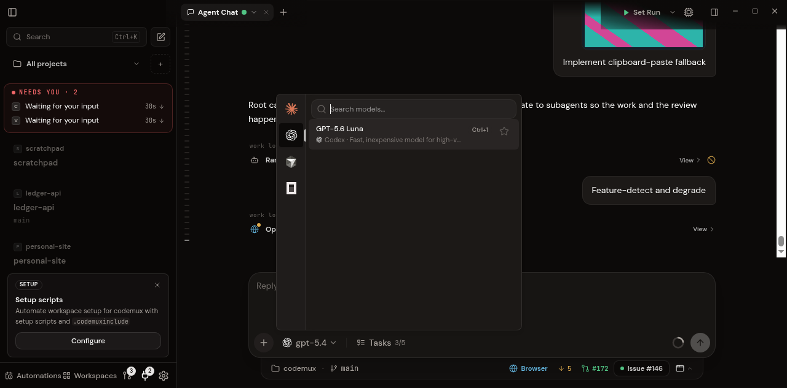
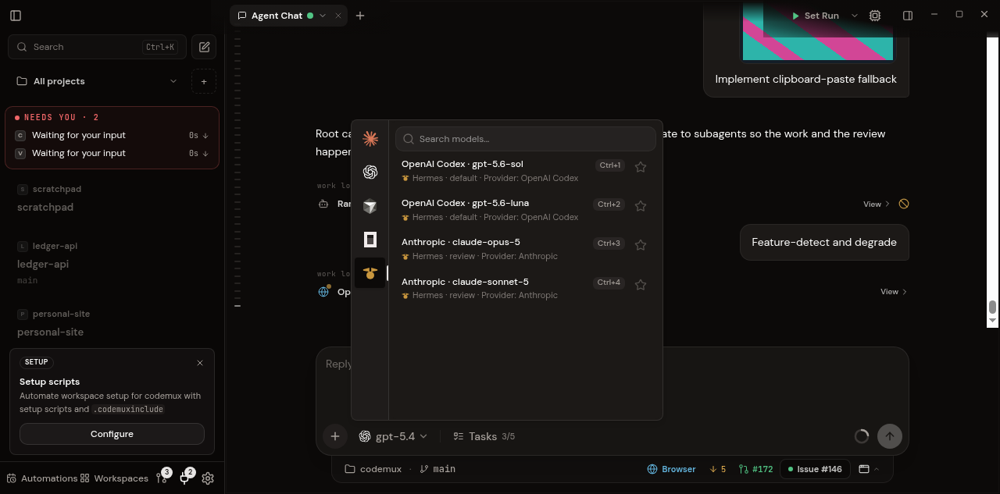

# Hermes Agent as a Codemux provider

Codemux talks to [Hermes Agent](https://github.com/) over the Agent Client
Protocol (ACP), the same transport Hermes offers Zed and JetBrains. A Hermes
thread in Codemux is the *same agent* you get from `hermes chat` — same profile,
same memory, same skills, same `state.db`. Sessions you start in Codemux show up
in the Hermes desktop sidebar and in `hermes sessions`, auto-titled.

## Install

Codemux shells out to whatever `hermes` is on your `PATH` (it also looks in
`~/.local/bin` and, on Windows, `%LOCALAPPDATA%\hermes\bin`). Nothing extra to
install on the Codemux side.

Check the ACP entry point is healthy:

```bash
hermes acp --check      # exits 0 in well under a second
```

Note that `--check` verifies the adapter imports; it does **not** boot an agent.
A green check does not guarantee `session/new` will succeed.

## Profiles

A Hermes profile is an isolated instance — its own credentials, approval policy,
model default, memory and skills. Codemux treats the profile as a first-class
field, so the picker shows `Hermes · <profile>` and lists each profile's own
model catalogue:

```bash
hermes profile list                 # what Codemux will enumerate
hermes -p <profile> model           # set that profile's default model
```

Profiles are discovered from disk with no process spawn, so opening the picker
is instant. The Hermes root itself *is* the `default` profile; the directories
under `<root>/profiles/` are the named ones.

**Switching profile restarts the session.** It is not a live model swap — a
different profile is a different agent, with different credentials and a
different approval policy, so reusing the running process would silently
diverge from what the UI shows.

## How sessions appear in both apps

One Codemux thread is one `hermes -p <profile> acp` process. Running it
alongside the Hermes desktop app on the same profile is a supported mode, not a
gamble: there is no lock or PID file, and multi-process access to `state.db` is
an explicit invariant (WAL).

Resuming works one way in v1: Codemux-created sessions appear in the Hermes
apps, but a session created in the desktop app or the CLI cannot yet be
continued inside Codemux. That needs an upstream change — the ACP server filters
`session/list` and `session/load` to `source == "acp"`.

## Permissions

ACP modes map to the three Hermes modes:

| Codemux | Hermes mode | Behaviour |
|---|---|---|
| Ask before edits | `default` | every edit raises an approval |
| Accept edits | `accept_edits` | workspace and `/tmp` edits auto-allow; sensitive paths still ask |
| Don't ask | `dont_ask` | file edits auto-allow except sensitive paths |

**ACP modes govern edits only.** Shell commands follow the profile's own
`approvals.mode` (default `smart`), which judges each command and can allow it
without prompting — so "Don't ask" does not silence shell approvals, and
"Ask before edits" does not guarantee a shell prompt. This is a Hermes policy
decision, not something Codemux overrides.

## Not supported in v1

Stated plainly, because most of these are upstream constraints rather than
things Codemux chose to skip.

- **Subagent results never come back.** If Hermes delegates a step, the turn
  completes but the delegated answer never re-enters the conversation. Upstream,
  ACP dispatches `delegate_task` with async delivery enabled and nothing on that
  path drains the completion queue. Codemux surfaces a warning when it happens;
  it cannot be fixed client-side. Zed and JetBrains users hit this too.
- **Cost accounting.** The context meter works (it is fed by the protocol's
  `usage_update`). Per-turn cost does not: the usage event is discarded before it
  reaches the frontend, and the usage dashboard reads provider history files that
  Hermes does not write. Hermes is deliberately excluded from that importer so it
  is not mis-parsed as a Codex rollout.
- **Desktop → Codemux resume.** One-way, as described above.
- **Bot-to-bot messaging.** `@profile` mentions and cross-profile chat live in
  the Hermes desktop plugin. Same-profile subagents run (delivery caveat aside);
  cross-profile conversation does not.
- **Cron and the skill curator.** ACP does not start Hermes' scheduler. A profile
  hosted *only* in Codemux runs neither its scheduled jobs nor the weekly
  curator pass. Both resume as soon as any CLI or desktop session runs.
- **Concurrent skill writes.** Memory writes are locked across processes;
  `SKILL.md` writes are not. Two background-review passes touching the same skill
  are last-writer-wins.
- **A failed turn can look like a successful one.** An agent exception comes back
  as an ordinary `end_turn` with the error as a message, so a host cannot tell
  success from failure from the protocol alone.
- **Approval timeout.** Approvals expire after 60 seconds; the configured
  `approvals.timeout` (default 300) is not read on this path. Shell approvals
  report a distinct timeout outcome, edit approvals hard-deny.
- **Cold start.** The first `session/new` on a machine with no model cache builds
  the catalogue inline and can stall for tens of seconds. Codemux seeds the
  picker from `config.yaml` so it is never empty, and sets a generous start
  timeout.

## Screenshots

Before — four providers, no Hermes:



After — Hermes in the rail, with each profile's own catalogue and the profile
rendered as its own field:


