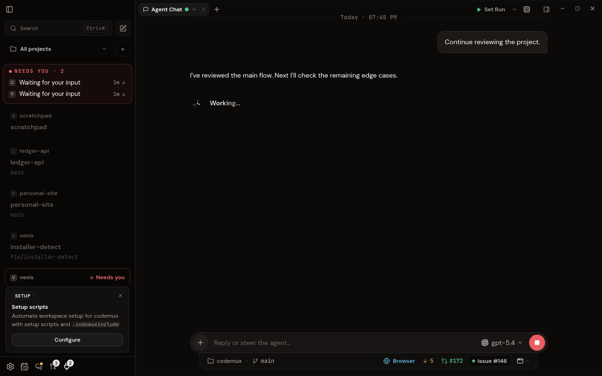

# Summarizing context

The chat activity line shows **Summarizing context…** while a provider reports
context compaction. It uses the existing animated marker, replaces the ordinary
live activity header, and returns to normal activity when compaction finishes.
Finishing compaction does not finish the turn. Stop, failure, session teardown,
and thread restart clear the transient state. Child-agent compaction does not
change the parent chat's status.

## Provider coverage

| Provider | Signal | Coverage |
| --- | --- | --- |
| Claude Code | SDK `system.status` with `compacting`, cleared by status reset or `compact_boundary` | Supported |
| Codex | `item/started` and `item/completed` for `contextCompaction` | Supported |
| OpenCode | Assistant `message.updated` with `summary: true`; `time.completed` ends the activity | Supported |
| Cursor | ACP bridge does not forward summarization lifecycle | Existing activity fallback |
| Grok Build | Live xAI `auto_compact_started`, `auto_compact_completed`, `auto_compact_failed`, `auto_compact_cancelled` | Automatic compaction supported |

Detection uses provider events, not token thresholds, elapsed time, or phrases
in generated text. Versions that omit these signals retain ordinary activity.
A cold connection during an already-running compaction cannot reconstruct a
start event it never received. A warm chat remount preserves known compaction
while the backend confirms that the run remains live.

Hermes Desktop uses its gateway's explicit `status.update` kinds `compacting`
and `compacted`, with per-session activity state. Those gateway events are not
part of Codemux's provider transports.

ACP's [experimental compaction proposal](https://agentclientprotocol.com/rfds/session-compaction)
could extend coverage to Cursor. Advertising
`clientCapabilities.session.compaction` commits the client to ID-addressed
records, summary patches/chunks, timeline placement, and replay semantics. This
status-only feature does not advertise that broader contract. CLI adoption is
also required.

Cursor CLI **2026.09.10-fd3934a** was checked against its
[official ACP documentation](https://cursor.com/docs/cli/acp) and installed ACP
adapter. Its terminal UI handles internal `summaryStarted` / `summaryCompleted`
events, but its ACP adapter forwards only text, thinking, and tool-call events.
It does not forward the summary lifecycle or emit the experimental ACP
compaction updates. This is source inspection, not a live compaction test;
future versions may add support.

Grok Build exposes its own xAI extension independently of the
experimental ACP contract. The official source emits all four `auto_compact_*`
lifecycle events through `x.ai/session_notification` (also transported as
`_x.ai/session_notification`). Codemux accepts only live notifications for the
matching session, rejects `_meta.isReplay`, and leaves child-session activity
alone. No prompt ID is required: model-switch compaction can occur while idle.
The installed **1.0.30** binary contains all four event tags. Manual `/compact`
only reports completion in the inspected source, so its full duration cannot
be shown reliably. See Grok's
[notification definitions](https://github.com/xai-org/grok-build/blob/a28ee2b2063426e8816e380ccea528b9de95e5da/crates/codegen/xai-grok-shell/src/extensions/notification.rs)
and [compaction lifecycle](https://github.com/xai-org/grok-build/blob/a28ee2b2063426e8816e380ccea528b9de95e5da/crates/codegen/xai-grok-shell/src/session/compaction.rs).

OpenCode's signal is defined in its
[compaction implementation](https://github.com/anomalyco/opencode/blob/dev/packages/opencode/src/session/compaction.ts).

## Visual evidence

Mock data at `http://localhost:1420`, captured with `codemux browser screenshot`.

Before:

After:

