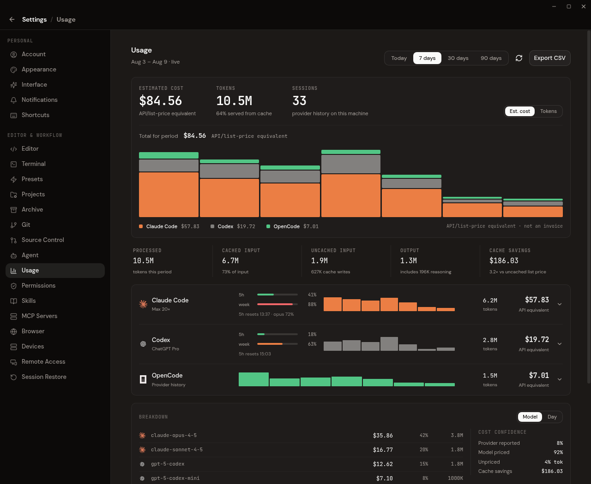
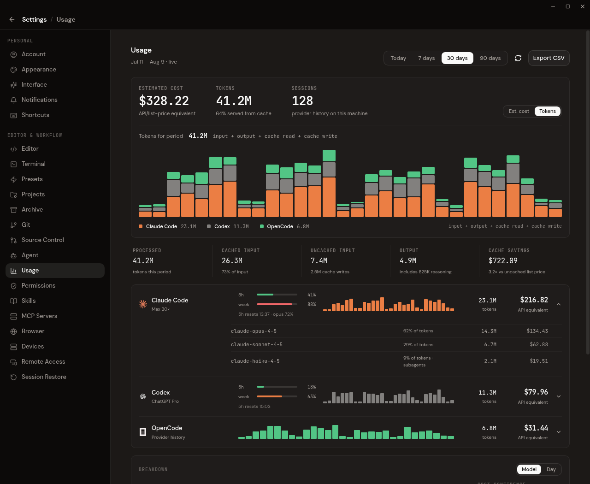

# Usage Dashboard

- Purpose: Define the source, accounting semantics, and UI contract for Settings → Usage.
- Audience: Contributors working on provider history, pricing, quota, or the usage UI.
- Status: Implemented.

## Product contract

Settings → Usage answers one narrow question: how much Claude Code, Codex, and OpenCode activity is recorded in those providers' local histories on this machine?

The answer is provider-wide, not Codemux-specific. A session counts whether it was launched by Codemux, another editor, or a terminal. Subagent work counts too and remains marked for per-model attribution.

Three boundaries keep the answer honest:

1. Provider-owned durable history is the only accounting source.
2. Cost is an API/list-price equivalent estimate, never a claim about the user's invoice.
3. Subscription quota is a separate live account snapshot and is never inferred from cost.

## Sources

| Provider | Durable source | Grain | Subagents |
|---|---|---|---|
| Claude Code | `~/.claude/projects/**/*.jsonl` | one deduplicated assistant response | `isSidechain` |
| Codex | `~/.codex/sessions/**/*.jsonl` | one `last_token_usage` delta per turn; cumulative fallback for old rollouts | `session_meta.payload.source.subagent` / `parent_thread_id` |
| OpenCode | local `opencode*.db` `message` rows; legacy `storage/message/**/*.json` fallback | one assistant message | parent OpenCode session |

OpenCode database discovery includes an explicit `OPENCODE_DB` and databases named `opencode*.db` in the platform data directory. SQLite is opened read-only. The importer queries only the `session` and `message` tables; credentials are out of scope.

Legacy OpenCode JSON is scanned even when SQLite exists because an interrupted migration can leave history in both places. The stable `opencode:<message-id>` key makes overlap harmless.

This is local history, not cloud account history. Activity from another machine appears only if the provider has copied that history onto this machine.

## Why there is no live accounting stream

Provider apps already persist the authoritative usage record. Recording a second stream from Codemux runtime events creates two hard problems: Codemux sessions can be counted twice when their transcripts are imported, and resumed/growing responses require fragile process-local baselines.

The dashboard therefore does not write runtime `UsageRecorded` events to the ledger. Importer version 3 clears legacy live/imported rows and rebuilds the cache from provider history.

`ContextUsageUpdated` is unrelated. It powers the composer's current-context meter and is intentionally a lossy snapshot, not accounting history.

## Materialized cache and idempotency

`agent_usage_ledger` is a materialized local cache, despite its historical name. Current rows use:

- `source = 'provider_history'`
- a provider-native `import_key`
- no workspace foreign key
- non-overlapping input, output, cache-read, and cache-write columns
- reasoning as an informational subset of output

The partial unique index on `import_key` guarantees one row per provider record. Import is an upsert with a null-safe change guard:

- an unchanged rescan writes nothing;
- a streaming response whose counters grew updates the existing row;
- resumed/forked transcripts carrying the same response deduplicate;
- overlapping OpenCode databases and legacy JSON deduplicate.

`usage_import_state` stores each source's size and modification time. SQLite signatures also include the WAL, because active messages may not yet be checkpointed into the main database. Changed JSONL transcripts are re-read in full because their session/model context can occur before the appended tail.

`usage.import_version` gates parser/pricing migrations. A mismatch clears the cache and source signatures, then re-derives every available row.

## Provider normalization

All downstream totals use four disjoint buckets:

```text
total = fresh input + output (reasoning included) + cache read + cache write
```

- Claude already reports disjoint buckets. Repeated records for the same `message.id` + `requestId` are cumulative snapshots, so the importer keeps per-field maxima. One-hour cache writes are retained long enough to apply Anthropic's distinct rate.
- Codex reports cached input inside `input_tokens`; cached and cache-write tokens are carved out to obtain fresh input. `last_token_usage` is preferred so day and model switches remain correct.
- OpenCode reports cache buckets beside input. Its separate reasoning count is folded into output and also retained as the reasoning subset.

Synthetic Claude messages and tokenless records are ignored.

Record timestamps are parsed by a hand-rolled ISO-8601 reader (`parse_iso8601_ms`) that honours `Z`, a numeric offset (`+02:00`, `-0500`, `+05`), and no suffix at all, with any fractional-second precision. An offset is subtracted rather than ignored, so a locally-stamped record is not filed hours — possibly a day bucket — late. A Claude record whose timestamp is unreadable keeps a zero placeholder that a later duplicate of the same `message.id` repairs.

## Cost semantics

Every dollar figure is labelled as an estimate or API equivalent. It does not mean “billed,” “owed,” “plan-covered,” or “saved by a subscription.” Codemux cannot reconstruct the user's actual settlement arrangement from historical token records.

Pricing order:

1. OpenCode's stored per-message cost, when present (`cost_source = 'provider'`).
2. Codemux's static model price table (`cost_source = 'table'`).
3. Unknown price (`cost_usd = NULL`), while tokens still count.

Cache-savings comparisons only use table-priced rows. Provider-catalogue costs are not mixed with a possibly different static input rate.

Pricing is frozen in the derived row until either its provider record changes or the importer version is bumped and rebuilt.

## Quota semantics

`ProviderRuntimeEvent::PlanUsageUpdated` remains a separate live path. `PlanQuotaStore` keeps only the newest in-memory provider snapshot because quota ages quickly and a persisted snapshot would be misleading after restart.

Quota may include provider-reported plan labels and 5-hour/weekly windows. A provider with no current quota reading shows no quota bars. Quota does not classify historical cost.

## UI and refresh

The page shows:

- estimated API/list-price-equivalent cost;
- processed tokens and token composition;
- distinct provider sessions;
- provider/model/subagent breakdowns;
- live quota bars when available;
- CSV export.

Buckets are aligned in the user's local time: hourly for **Today**, daily otherwise. "Today" is a trailing 24-hour window rather than a calendar day, so its older buckets are labelled `Yesterday {hour}:00` — in the hover readout, the header range, and the CSV's `bucket_start` column alike.

The page scans provider history before its first summary query. Manual refresh and the 30-second open-page poll both scan before querying, so a running provider session becomes visible without restarting Codemux.

The footer states that the figures come from Claude Code, Codex, and OpenCode histories on this machine, regardless of launcher.

## Screenshots

### Cost overview



### Token and provider detail



## Key files

- `src-tauri/src/commands/usage_import.rs` — provider discovery, parsing, deduplication, and scan command
- `src-tauri/src/database.rs` — cache schema, provider-row upsert, rebuild, and read query
- `src-tauri/src/commands/usage.rs` — period aggregation, estimates, composition, confidence, quota
- `src/components/settings/usage-section.tsx` — dashboard and refresh behavior
- `src/tauri/commands.ts` — frontend IPC contract
- `src/dev/mock-fixtures.ts` — deterministic browser-dev data

## Verification

- Parser fixtures cover Claude cumulative records/cache TTLs, Codex per-turn normalization/model switches, and OpenCode message normalization.
- Database tests cover idempotent no-op rescans, growing-row updates, provider/table cost provenance, and full cache rebuild.
- UI tests cover simple estimate wording, quota independence, provider-history scanning, refresh, totals, and CSV export.
- Default repository verification remains `npm run verify` with `CARGO_BUILD_JOBS=2`.
