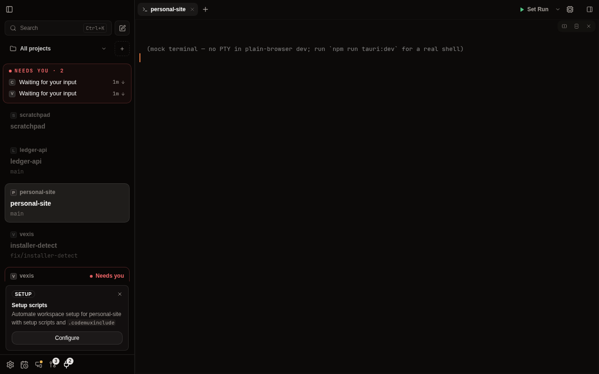
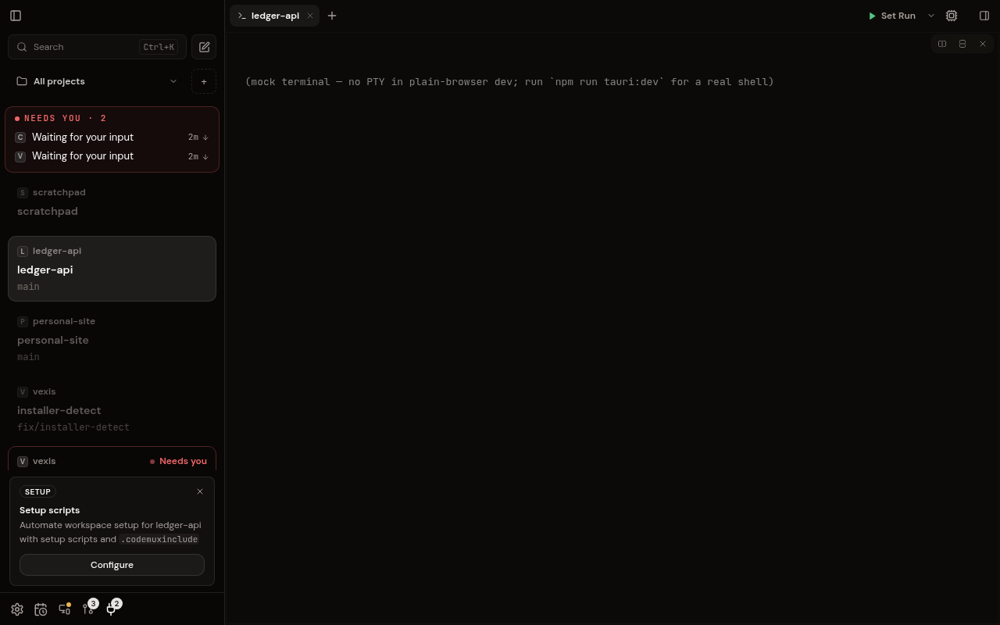

# Independent remote workspace selection (#366)

Remote clients seed their selection from the shared snapshot once, then keep it in their own store and persist it by host in browser storage. Desktop activation continues to own `active_workspace_id`, including control socket and MCP operations. A missing remote workspace falls back to a surviving workspace locally.

The remote bridge logs a client identifier and connection identifier, rejects commands outside its explicit allowlist, and forces workspace/pane mutations to preserve desktop selection. Workspace and chat-pane creation can publish the initial thread binding in the same state mutation. Tabs, panes, notifications, and workspace data remain shared.

## Verification

- `npm run check`.
- Affected Vitest files for stores, navigation, draft materialization, remote transport/shim, and changed components. Includes persisted selection, backend restart, deletion fallback, overlapping activation replies, rejected activation, and host-scoped storage.
- `cargo check -j 2 --manifest-path src-tauri/Cargo.toml`.
- `cargo test -j 2 --manifest-path src-tauri/Cargo.toml --test serve_web_remote_roundtrip --test workspace_activation_ipc -- --test-threads=2`.

The WebSocket test boots an isolated real headless backend, pairs two connections, checks the frontend's bootstrap commands, touches separate workspaces, materializes a bound chat pane, attempts to override the bridge's selection policy, rejects destructive/dev/unknown commands, and closes a remote workspace without moving the desktop. The IPC test verifies that touch leaves persisted desktop selection unchanged and desktop activation/cycling still persists.

Build setup used the repository's agent-browser staging script and the CI-style empty resource placeholders for the unused Claude sidecar and remote binary. These are ignored build artifacts; neither provider sessions nor SSH hosts are launched by these tests.

## Visual evidence

Screenshots use only the development mock fixture, captured with `codemux browser screenshot`. The same simulated shared update changes desktop selection from `ledger-api` to `personal-site`. Before is the unmodified base checkout; after is this implementation. Real transport behavior is covered separately by the WebSocket test above.

| Before: remote follows desktop | After: remote stays on ledger-api |
| --- | --- |
|  |  |

At the 390×844 mobile viewport, clicking `ledger-api` in the workspace rail kept the local selection on `ws-ledger-main` while subsequent mock snapshots carried `ws-codemux-chat` as the shared desktop selection. This was checked through the rendered UI and the live store selector.
