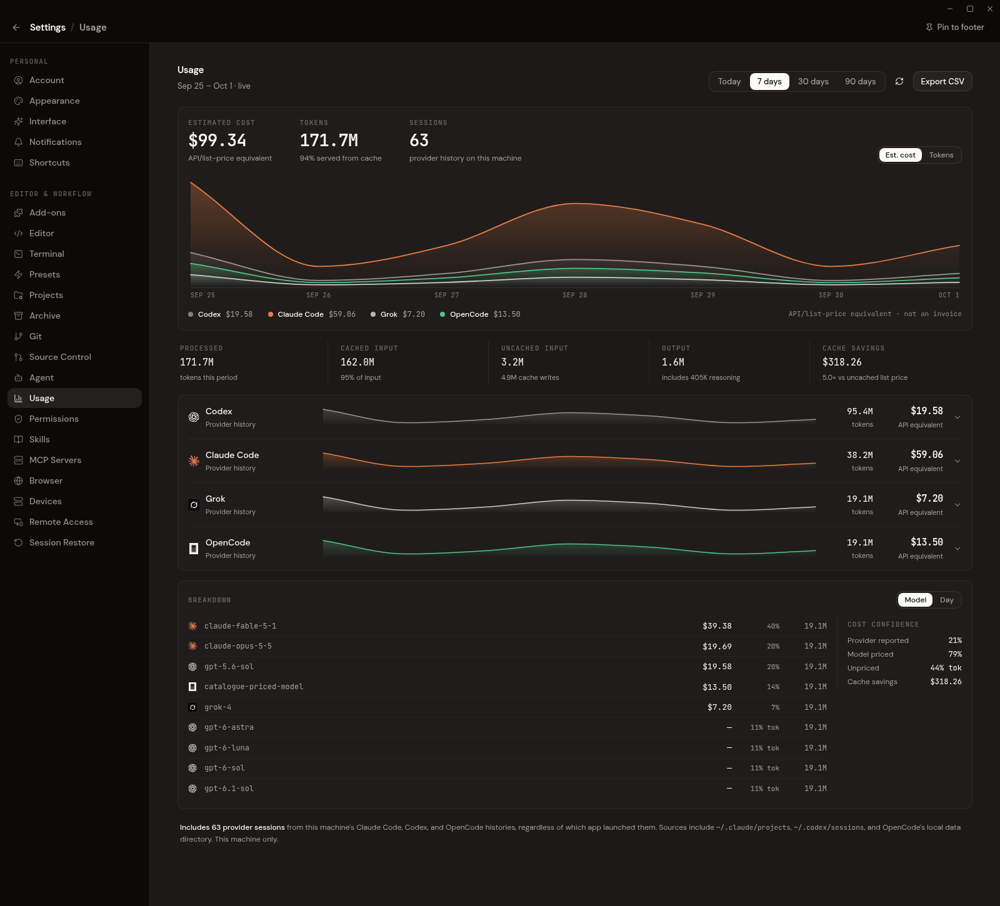
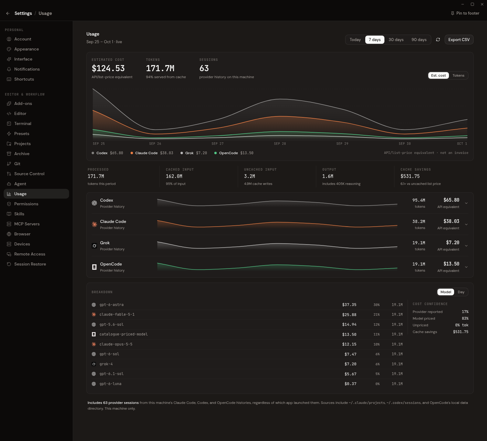

# Usage tracker audit — 2026-10-01

Codemux records provider-supplied token counts, but usually calculates the
dashboard's dollar estimates itself. There is no shared official billing feed
covering every supported agent. Updating a provider CLI does not update
Codemux's fallback price table.

## Coverage and ownership

These findings come from `commands/usage_import.rs`,
`commands/agent_chat.rs::bridge_grok_usage_event`, and the provider adapters.

| Agent | Dashboard usage source | Dashboard cost source | Automatic updates |
| --- | --- | --- | --- |
| Claude Code | Local `~/.claude/projects/**/*.jsonl` assistant usage; response IDs deduplicated, cache writes split by TTL | Codemux's static list prices | History scan on page open and every 30 seconds; prices require a Codemux update |
| Codex | Local `~/.codex/sessions/**/*.jsonl` token events, with model attribution from turn context | Codemux's static list prices | Same incremental history scan; prices require a Codemux update |
| OpenCode | Local SQLite assistant messages and legacy JSON records | Stored OpenCode `cost`, including valid zero; static fallback only when cost is missing/invalid | Codemux imports changed records; existing costs follow what OpenCode stored |
| Grok Build | Official ACP prompt usage, saved at turn completion in Codemux | Provider-reported USD ticks; incomplete/partial costs stay unknown | New completed Codemux turns; no external-session history importer |
| Cursor | No durable dashboard accounting | None | ACP usage can update chat context, but its `UsageRecorded` events are discarded by the command bridge |
| Hermes | No durable dashboard accounting | None | Its adapter handles context occupancy only; no history importer or cost ledger bridge |

Quota bars are a separate in-memory stream, not calculated from token prices.
Claude and Codex adapters receive provider quota/authentication information.
[Codex's official app-server documentation](https://developers.openai.com/codex/app-server)
describes `thread/tokenUsage/updated`, `account/read`, and
`account/rateLimits/read` / `updated`.

Claude's own session cost is also calculated locally and is an estimate; its
Console is the billing authority. Subscription quota and API-equivalent cost
are different quantities.
[Claude Code cost documentation](https://code.claude.com/docs/en/costs).

OpenCode's catalogue comes from models.dev and can include custom pricing.
Its upstream accounting keeps reasoning separate from output, so the importer
adds reasoning to billed output exactly once. “Provider reported” here means
OpenCode supplied the number, not that an inference vendor certified the bill.
[OpenCode providers](https://opencode.ai/v2/docs/providers),
[upstream token/cost accounting](https://github.com/anomalyco/opencode/blob/dev/packages/opencode/src/acp/usage.ts).

xAI documents exact per-request costs, including discounts and server-side
tools, with 10 billion ticks per USD. Grok Build exposes its ACP equivalent
as `costUsdTicks`; Codemux already converts those without a price table.
[xAI cost tracking](https://docs.x.ai/developers/cost-tracking).

[Cursor's official ACP documentation](https://cursor.com/docs/cli/acp)
does not establish a durable local billing-history format. Hermes upstream
distinguishes context occupancy (`used`/`size`) from prompt usage. Neither is
currently connected to this dashboard in Codemux.
[Hermes ACP source](https://github.com/NousResearch/hermes-agent/blob/main/acp_adapter/server.py).

## Verified pricing corrections

Rates below are USD per million tokens, standard/global pricing. The OpenAI
rates use the short-context tier.

| Model | Input | Output | Cache read | Cache write |
| --- | ---: | ---: | ---: | ---: |
| GPT-6.1 Sol | 2 | 10 | 0.10 | 2.50 |
| GPT-6 Sol | 2 | 10 | 0.20 | 2.50 |
| GPT-6 Astra | 10 | 50 | 1 | 12.50 |
| GPT-6 Luna | 0.10 | 0.50 | 0.01 | 0.125 |
| GPT-5.6 Sol | 4 | 20 | 0.40 | 5 |
| Claude Opus 5.5 | 4 | 20 | 0.20 | 5 (5m), 8 (1h) |
| Claude Sonnet 5.5 | 2 | 10 | 0.20 | 2.50 (5m), 4 (1h) |
| Claude Fable/Mythos 5.1 | 10 | 50 | 0.25 | 12.50 (5m), 20 (1h) |

The old table missed GPT-6/6.1, charged GPT-5.6 Sol at $5/$30, and applied
older Claude cache discounts to new generations. Sonnet 5 still lists $2/$10;
the previous comment predicting a September expiry was removed. Older Claude
generations retain their distinct published prices.
[Official OpenAI pricing](https://developers.openai.com/api/docs/pricing),
[official Anthropic pricing](https://platform.claude.com/docs/en/about-claude/pricing).

The audit also corrected GPT-5.1 Codex Mini, older Opus 4 IDs, GPT-4o's May
2024 snapshot, and missing legacy OpenAI tiers. Codex Mini's published rates
are $0.25 input, $0.025 cached input, and $2 output.
[Official Codex Mini model page](https://developers.openai.com/api/docs/models/gpt-5.1-codex-mini).

## Changes and remaining limits

- Updated `agent_provider/pricing.rs` and replaced arbitrary substring
  matching with verified model IDs and dated snapshots. Unknown generations
  and internal labels such as `codex-auto-review` remain unpriced. Cache-read
  prices are explicit where the standard family multiplier no longer applies.
- Bumped `IMPORT_VERSION` to 4. On the next history scan, the new build clears
  rebuildable cached rows/signatures and recalculates from histories still on
  disk. Grok's exact live rows survive. OpenCode's stored costs retain priority.
- Added regressions for current rates, model identity, old-cache invalidation,
  and provider-cost precedence.
- Fixed Codex duplicate detection: identical last-request counters must count
  again when cumulative usage grows. A true replay repeats both values.
  Older histories without cumulative counters retain the previous fallback.

The fallback is a **current list-price token estimate**, including for older
sessions. It does not reconstruct historical promotions, long-context or
fast/ultrafast tiers, regional premiums, negotiated contracts, subscription
charges, or server-side tool fees. OpenAI publishes higher rates above 272K
input tokens; Codex per-turn usage can aggregate multiple requests, so applying
that threshold to a turn total would incorrectly surcharge short requests.
OpenCode records do not preserve the Claude cache-write TTL split for fallback
pricing. Provider-reported costs avoid Codemux's fallback limitations, subject
to that provider's own accounting completeness.

Cursor/Hermes dashboard coverage needs a dedicated integration with stable
usage semantics and replay-safe keys. Their context occupancy must never be
treated as a cumulative bill. No new accounting was invented during this
pricing update.

The fallback remains static. Future maintenance should verify official rate
cards and bump the importer version with price changes. GPT-5.6 Sol's current
promotion is guaranteed only through at least November 21, 2026. Any future
remote catalogue should preserve provider-reported costs, use explicit model
identity and freshness metadata, and handle request modifiers before claiming
to reproduce billing.

## Verification

`cargo check -j 2` passed. Relevant Rust tests passed: 29 importer tests,
13 pricing tests, and the database test preserving exact Grok rows on rebuild.
The worktree lacks packaged helper binaries, so Cargo checks used
`TAURI_CONFIG='{"bundle":{"externalBin":[],"resources":[]}}'` to exclude
packaging-only inputs. No application or bundling configuration was edited.

`npm run check` and all 36 tests in
`src/components/settings/usage-section.test.tsx` passed. Before/after browser
verification used identical synthetic usage rows, calculated by the old/new
Rust price tables and the dashboard's actual aggregation function. The sample
has 171.7M tokens in both views; unpriced tokens fall from 44% to 0%. OpenCode
and Grok reported costs remain unchanged. These are sample totals, not account
billing figures.

